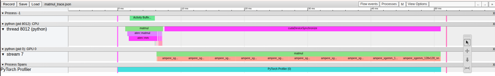

# Week 01 — GPU Profiling & The Attention Memory Problem

## Goal of This Week
Understand why LLM inference is slow **before** attempting to fix anything.
Learn to use PyTorch Profiler to see exactly where time and memory are wasted.

---

## What I Built
- `matmul_profile.py` — benchmarks matrix multiplication across sizes, measures TFLOPS
- `attention_profile.py` — profiles standard dot-product attention across sequence lengths, tracks memory

---

## Core Mental Model Learned

Every GPU has three completely separate resources. Confusing them is the #1 mistake beginners make:

```
┌─────────────────────────────────────────────────────────┐
│                    RTX 3050 Laptop                      │
│                                                         │
│  VRAM (4GB)          →   How much data fits on GPU      │
│  Bandwidth (192GB/s) →   How fast data moves to cores   │
│  Compute (9 TFLOPS)  →   How fast math happens          │
└─────────────────────────────────────────────────────────┘
```

**Kitchen analogy:**
- VRAM = refrigerator (storage, far from stove)
- Bandwidth = how fast you walk fridge → counter
- Compute = how fast the chef cooks once ingredients arrive

**Memory-bound:** Chef is idle, waiting for ingredients. Bandwidth is the bottleneck.
**Compute-bound:** Ingredients arrive fast enough, chef is the bottleneck.

---

## Experiment 1 — Matrix Multiplication Benchmark

### Results
```
Size 512x512:   Time: 0.08 ms  →  3.48 TFLOPS
Size 1024x1024: Time: 0.49 ms  →  4.35 TFLOPS
Size 2048x2048: Time: 3.76 ms  →  4.57 TFLOPS
Size 4096x4096: Time: 31.56 ms →  4.35 TFLOPS
```

### What This Proves
- RTX 3050 theoretical peak = **9 TFLOPS**
- Actual measured = **~4.5 TFLOPS = 50% utilization**
- The other 50% of the time, compute cores are **idle waiting for data**
- Matmul at these sizes is **memory-bound** — bandwidth cannot feed data fast enough

### Why Time Is Not Linear
Matmul complexity is O(n³).
Double the matrix size → roughly 8x the work.
```
512 → 1024 (2x size) → time goes from 0.08ms to 0.49ms (~6x)
```

---

## Experiment 2 — PyTorch Profiler on Matmul

### Key Observations From Profiler Table
```
aten::mm  →  CPU: 37ms  |  CUDA: 41ms  |  171 GFLOPs
```

- CPU time ≈ CUDA time because CPU was **blocked waiting** for GPU to finish
- The actual CUDA kernel that ran: `ampere_sgemm_128x128_nn`
  - `ampere` = GPU architecture (RTX 3050 is Ampere generation)
  - `sgemm` = Single precision General Matrix Multiply
  - `128x128` = internal tile size
  - `nn` = neither matrix is transposed
- This is NVIDIA's pre-written optimized kernel PyTorch calls automatically

### Chrome Trace Reading



The giant pink block = CPU doing nothing, just waiting for GPU to report back.
This is called **synchronization overhead.**

---

## Experiment 3 — Attention Profiling (The Important One)

### Setup
Standard dot-product attention: `Attention(Q,K,V) = softmax(QKᵀ/√d) × V`
Tested at sequence lengths: 512, 1024, 2048

### Memory Results — The Quadratic Problem Proved

| Sequence Length | Scores Matrix Size | CUDA Memory Used | Total Time |
|---|---|---|---|
| 512 | 512×512 | 90 MB | 4.4 ms |
| 1024 | 1024×1024 | 340 MB | 16.9 ms |
| 2048 | 2048×2048 | 1.29 GB | 75.5 ms |

**Sequence doubled → memory 4x → time 4x**
This is **O(S²) quadratic growth** measured on real hardware.

### Why Quadratic?
Every word must compare against every other word in the sequence.
```
4 words  → 4×4  = 16 comparisons
8 words  → 8×8  = 64 comparisons  (2x words = 4x comparisons)
2048 words → 2048×2048 = 4,194,304 comparisons
```

### The Softmax Bottleneck
At seq_len=2048, softmax alone consumed **21% of total GPU time.**

Why? Softmax reads the entire S×S scores matrix from VRAM, computes, writes back.
The bigger the matrix, the more VRAM trips. This is the most memory-bound operation in attention.

```
seq_len=512:  softmax barely visible in profiler
seq_len=2048: softmax = 15.99ms out of 75.5ms total
```

### The Core Problem In Plain English
Standard attention forces the GPU to make 3 separate trips to VRAM:

```
Trip 1: Compute Q×Kᵀ  → write scores matrix (1.29GB) to VRAM
Trip 2: Softmax       → read scores from VRAM, write back
Trip 3: scores×V      → read scores from VRAM again
```

Each trip = bandwidth bottleneck = compute cores sitting idle.
The scores matrix is the culprit. It grows quadratically and gets read multiple times.

---

## What FlashAttention Solves

FlashAttention (Dao et al., 2022) eliminates all 3 VRAM trips using **tiling:**

```
Instead of:  store full 1.29GB scores matrix in VRAM
FlashAttention: process small tiles, keep on fast on-chip memory, discard after use
```

Same mathematical result. Memory usage drops from O(S²) to O(S).

The specific number FlashAttention directly fixes:
**CUDA Mem for aten::bmm — from 1.29GB down to a small constant tile size.**

---

## Key Profiler Skills Learned

| Skill | What It Tells You |
|---|---|
| `CUDA total` column | How long the GPU actually spent on this operation |
| `CUDA Mem` column | How much GPU memory this operation allocated |
| `# of Calls` | How many times this operation ran |
| `ampere_sgemm_*` | The actual low-level CUDA kernel PyTorch dispatched |
| Chrome trace pink block | CPU waiting for GPU (cudaDeviceSynchronize) |
| Chrome trace GPU stream | Actual kernel execution timeline on GPU |

---

## Week 1 Summary — One Paragraph

Standard attention has a quadratic memory problem. The S×S scores matrix grows 4x every time sequence length doubles. At seq_len=2048 on a real GPU, this matrix consumes 1.29GB of VRAM and forces the GPU to make multiple slow round-trips between compute cores and memory. This makes attention memory-bound — compute cores sit idle waiting for data. Softmax alone consumed 21% of total attention time at seq_len=2048. FlashAttention solves this by tiling — processing small chunks and never storing the full scores matrix in VRAM, reducing memory from O(S²) to O(S).
